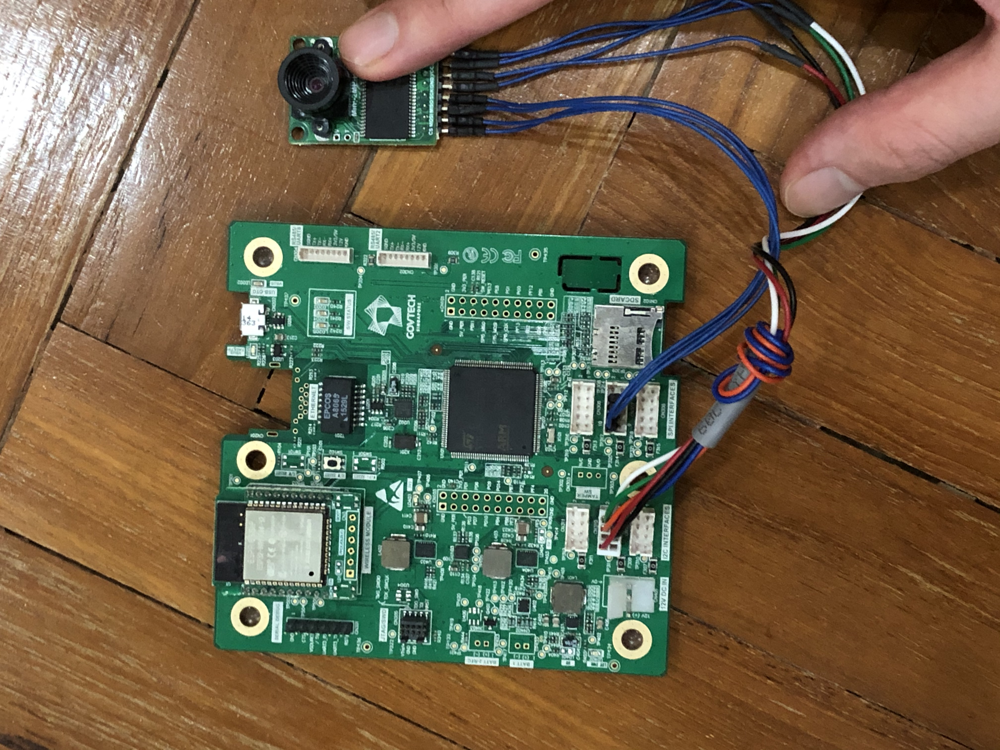
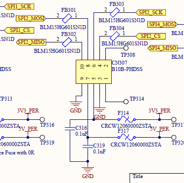
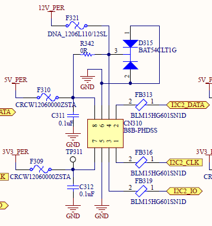
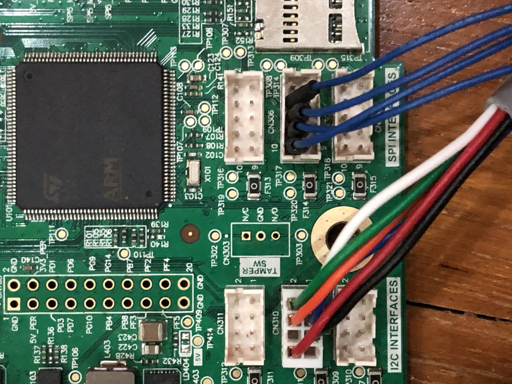
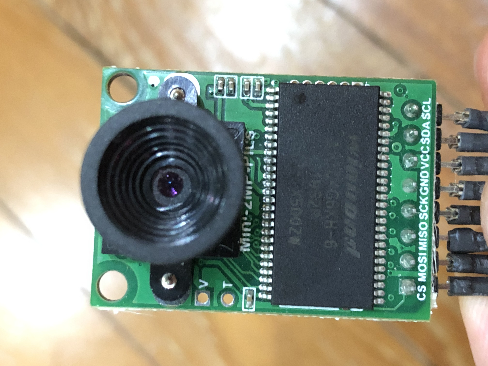

## Pins Connection Guide

The fully connected setup should look like this:

The SPI and I2C pin configurations for the MANUCA DK board are shown here:

They are located on the board as shown:  

These must be connected to the SPI and I2C interface of the camera as shown here:

Concretely, you should connect:

- Camera CS to SPI2 CS (pin 4)
- Camera MOSI to SPI2 MOSI (pin 8)
- Camera MISO to SPI2 MISO (pin 10)
- Camera SCK to SPI2 SCK (pin 6)
- Camera GND to I2C2 GND (pin 5)
- Camera VCC to I2C2 5V_PER (pin 8)
- Camera SDA to I2C2 DATA (pin 2)
- Camera SCL to I2C2 CLK (pin 1)

